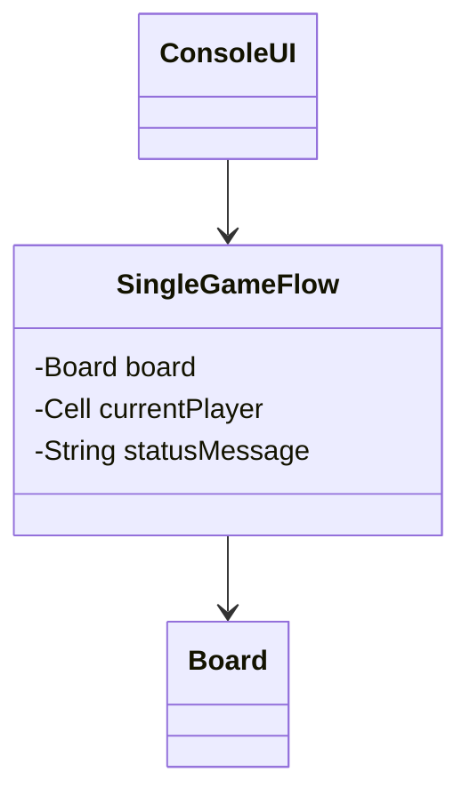
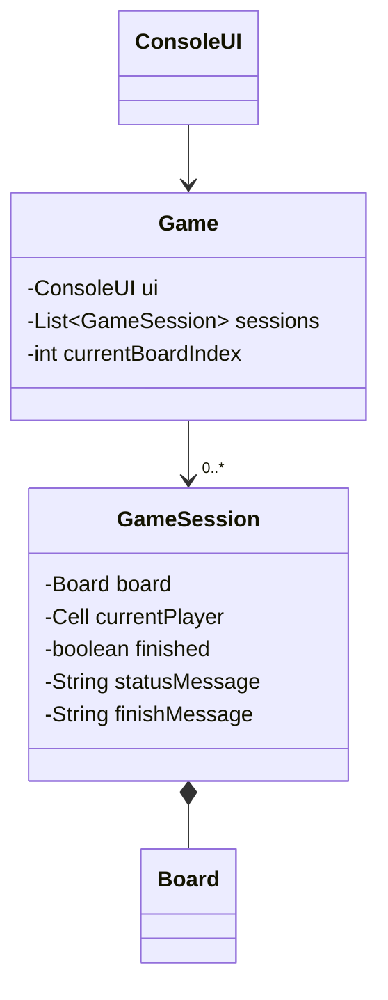

# Lab2 实验报告

## 1. 实验目标与任务概述

本次 Lab2 是在 Lab1 基础上的升级实现，目标是将原来的简化版单盘程序扩展为支持完整黑白棋规则和多盘并行运行的控制台程序。结合题目要求，当前版本重点完成了两部分内容：一是补全合法落子、翻子、自动弃权和单盘结束条件；二是支持固定 3 个棋盘同时存在，并允许玩家在不同棋盘之间切换且保留各自状态。

## 2. 项目整体实现说明

当前项目使用 Java + Maven 开发，界面基于 Lanterna 实现。程序已经支持完整合法落子检测、八方向翻子、无合法步自动弃权、`quit` 退出、单盘结束判断以及固定 3 盘并行运行。用户既可以输入落子位置，也可以输入棋盘编号切换对局，切换后原棋盘状态能够继续保留。

## 3. 各源代码文件的主要功能

本项目当前实际包含 7 个主要 Java 源代码文件，各文件职责如下。

| 文件名 | 主要职责 |
| --- | --- |
| `Main.java` | 程序入口，负责创建终端界面并启动游戏。 |
| `Game.java` | 负责多盘管理、输入分流以及当前棋盘切换。 |
| `GameSession.java` | 保存单盘的棋盘状态、当前玩家、结束状态和提示信息。 |
| `Board.java` | 实现棋盘初始化、合法落子检测、翻子和棋子统计等规则逻辑。 |
| `ConsoleUI.java` | 负责棋盘显示、状态信息展示和终端输入读取。 |
| `Cell.java` | 定义空格、黑棋、白棋三种格子状态。 |
| `Position.java` | 表示棋盘上的行列坐标。 |

另外，`pom.xml` 负责依赖和启动配置，是项目能够编译运行的基础。

## 4. 关键代码与设计思路

本项目的核心设计思路是把“规则判断”“单盘状态”“多盘调度”“界面显示”分开处理。

### 4.1 单盘规则实现

完整黑白棋规则主要由 `Board` 负责。程序先判断一个位置在八个方向上是否能夹住对方棋子，只有能翻子时才允许落子；落子成功后，再统一翻转所有满足条件的位置。

```java
public boolean isLegalMove(Position position, Cell player) {
    return !findFlippablePositions(position, player).isEmpty();
}
```

### 4.2 单盘状态管理

`GameSession` 表示一局独立对局，保存当前棋盘、当前玩家、结束状态和提示信息。自动弃权与单盘结束判断也放在这里处理，这样单盘逻辑比较集中。

### 4.3 多盘调度

`Game` 使用 `List<GameSession>` 管理多个棋盘，通过 `currentBoardIndex` 记录当前选中的棋盘。这样切换棋盘时只需要切换当前索引，不会破坏原有对局状态。

### 4.4 界面与输入

`ConsoleUI` 负责显示当前棋盘、当前玩家、黑白数量和提示信息，并读取用户输入。`Game` 再把输入区分为落子位置、棋盘编号和 `quit` 三类处理，符合多盘交互要求。

## 5. 与 Lab1 相比的增量内容分析
这一节主要总结 Lab2 相比 Lab1 在功能和交互上的增量；涉及代码结构如何为多盘做调整，放在第 6 节单独分析。

### 5.1 游戏规则的增量

Lab1 主要是简化版单盘程序，而 Lab2 已经补全了更完整的黑白棋规则。与 Lab1 相比，当前版本新增了以下内容：

- 合法落子必须满足翻转条件，不能只判断当前位置是否为空。
- 一次落子后需要按照八个方向统一翻转被夹住的对方棋子。
- 当一方没有合法步时，程序会自动弃权，而不是由玩家随意决定。
- 单盘结束条件更加完整，包括棋盘填满、双方都无合法步，以及输入 `quit` 退出程序。

### 5.2 多盘能力的增量

Lab2 在单盘基础上增加了多盘并行运行能力。当前程序启动后会固定创建 3 个棋盘，并默认进入第 1 盘。与 Lab1 相比，新增的能力主要有：

- 支持多个棋盘同时存在，而不是只维护一个棋盘。
- 支持在不同棋盘之间切换。
- 每个棋盘都能保留自己的进度，不会因为切盘而重置。
- 某一盘结束后只结束该盘，不会直接结束整个程序。

### 5.3 交互方式的增量

Lab1 的输入主要面向单盘落子，而 Lab2 的输入需要同时适配多盘场景。当前程序支持三类输入：

- 落子位置，例如 `D3`
- 棋盘编号，例如 `2`
- 退出命令 `quit`

同时，界面中会显示 `Current Board`、`Current Player`、`Black`、`White` 等信息，使用户能够明确知道当前正在操作哪一盘、轮到哪一方以及当前棋面情况。

总的来说，第 5 节的增量重点可以概括为：Lab2 不仅把单盘游戏规则补全了，还把程序从“单盘交互”扩展成了“多盘切换交互”。至于为了支持这种变化，代码结构具体做了哪些调整，则放到下一节继续分析。

## 6. 支持多盘游戏后的代码结构变化分析
这一部分的关键不只是“多创建几个棋盘”，而是把原来单盘程序中的状态重新拆分。改为支持多盘后，代码需要明确区分“每一盘自己保存的状态”和“整个程序统一管理的状态”。

### 6.1 结构变动的要点

- 单盘思路下，主流程通常只需要维护一个棋盘、一个当前玩家和一份提示信息。
- 改成多盘后，这些状态不能再放在一份全局变量里，否则切换棋盘时会互相覆盖。
- 当前 Lab2 的做法是保留 `Board` 作为单盘规则类，新引入 `GameSession` 保存每盘独立状态，再由 `Game` 统一管理多个 `GameSession`。

因此，当前结构变化可以概括为：

- `Board`：继续负责单盘棋面和规则，不直接管理多盘。
- `GameSession`：新增的单盘会话层，保存 `Board`、`currentPlayer`、`finished`、`statusMessage`、`finishMessage`。
- `Game`：从原本的单盘流程控制，扩展为多盘管理器，负责 `List<GameSession>` 和 `currentBoardIndex`。
- `ConsoleUI`：不保存多盘状态，只负责显示当前选中的那一盘。

### 6.2 状态归属的变化

| 状态类型 | 具体内容 | 当前归属 |
| --- | --- | --- |
| 单盘状态 | `Board`、`currentPlayer`、`finished`、`statusMessage`、`finishMessage` | `GameSession` |
| 全局状态 | `List<GameSession> sessions`、`currentBoardIndex`、输入分发逻辑 | `Game` |

这样的拆分使得每个棋盘都能独立保存进度，而程序整体只负责“当前操作哪一盘”。

### 6.3 UML：从单盘结构到多盘结构

下图中的第一个 UML 是单盘结构的抽象示意，第二个 UML 对应当前 Lab2 的多盘结构。两者放在一起，更能看出这次结构变化的重点。

单盘结构抽象示意：



当前 Lab2 多盘结构：



从这两个图可以看到，Lab2 最重要的结构变化是：把原来集中在单盘流程中的状态拆分出来，形成“`Game` 负责多盘管理，`GameSession` 负责单盘状态，`Board` 负责单盘规则”的分层结构。也正因为有了这一层拆分，程序才能在切换棋盘后仍然保留每盘各自的进度和回合信息。

## 7. 运行结果说明

根据当前程序实际实现，运行效果可以概括如下：

- 程序启动后默认进入 1 号棋盘。
- 界面会显示 `Current Board`、`Current Player`、`Black`、`White` 等信息。
- 输入合法落子后，棋盘会刷新，并更新当前玩家与棋子数量。
- 输入棋盘编号后可以切换到对应棋盘，并保留之前棋盘的状态。
- 输入非法落子时，界面会显示错误提示，而不会错误修改棋盘。
- 某一盘结束后，程序只提示该盘结束，不会导致整个程序退出，用户仍可切换到其他棋盘继续操作。
- 输入 `quit` 后，整个程序退出。

需要补充说明的是，当前版本在单盘结束时会给出“棋盘结束”的提示，并继续显示黑白数量；但当前代码尚未额外输出“BLACK wins / WHITE wins / Draw”这类胜负提示。

下面给出报告中建议保留的截图位置，便于后续手动补图。

### 7.1 程序启动初始界面

【截图1：程序启动初始界面】

说明：展示程序启动后默认进入 1 号棋盘的界面，包含棋盘、当前玩家、黑白棋子数和输入提示。

### 7.2 1 号棋盘合法落子后的界面

【截图2：1号棋盘落子后的界面】

说明：展示在 1 号棋盘输入一个合法位置后，棋盘刷新、棋子翻转以及提示信息变化的结果。

### 7.3 切换到 2 号棋盘的界面

【截图3：切换到2号棋盘的界面】

说明：展示输入棋盘编号后切换到 2 号棋盘的效果，并体现当前棋盘编号已经变化。

### 7.4 非法输入或非法落子提示界面

【截图4：非法输入提示界面】

说明：展示输入非法落子后界面给出的提示信息，例如“当前位置非空”或“该步不能翻转对方棋子”。

### 7.5 多盘状态不同的界面

【截图5：多盘状态不同的界面】

说明：展示 1 号棋盘和 2 号棋盘处于不同进度时的界面效果，用于说明切换棋盘后状态被正确保留。

如有条件，也可以补充一张结束界面截图：

【截图6：某盘结束但程序仍可切换其他棋盘的界面】

说明：展示某一盘结束后出现结束提示，但程序整体并未退出，仍可继续切换到其他棋盘。

## 8. 可选部分：使用大模型辅助开发的体会

在本次实验过程中，可以把大模型主要用于两个方面：一是帮助梳理题目要求和阶段目标，二是辅助进行代码实现、重构和文案整理。

我觉得比较有帮助的一点是，可以先把实验要求整理成比较明确的约束，例如只修改 `lab2/`、优先做增量实现、避免随意扩展功能。这样在后续编码时更容易控制范围，也能减少“写着写着偏题”的问题。

另外，在支持多盘结构时，如果没有提前把“哪些状态属于单盘、哪些状态属于全局”想清楚，代码会比较容易混乱。借助大模型做结构分析时，我最大的体会是：比起直接让它一次性重写全部代码，更有效的方式是先拆清楚阶段目标，再逐步实现和核对。

当然，大模型给出的建议也不能直接照搬，最后还是要结合实验 PDF、当前代码和真实运行效果做人工确认，尤其是涉及类职责划分和交互细节时更是如此。

## 9. 总结

本次 Lab2 在 Lab1 的基础上完成了两个关键升级：一是将单盘逻辑提升为完整黑白棋规则，二是将程序结构扩展为支持固定 3 盘并行运行的多对局系统。

从当前实现来看，`Board`、`GameSession`、`Game`、`ConsoleUI` 之间的分工已经较为清晰：`Board` 负责规则，`GameSession` 负责单盘状态，`Game` 负责多盘调度，`ConsoleUI` 负责终端显示与输入。这种结构不仅满足了当前 Lab2 的要求，也为后续继续扩展多盘管理能力打下了基础。

整体而言，本次实验的重点不只是“多加两个棋盘”，而是通过结构调整把单盘游戏演进为多盘可管理的程序。这部分增量也是本次 Lab2 最值得总结和说明的内容。
